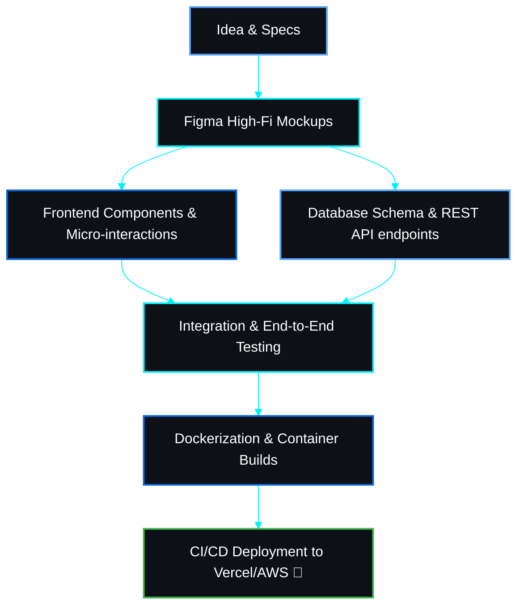

<div align="center">

<!-- Custom Generated Cyber-Glow Banner -->


<br/><br/>

<!-- Typing Animation -->
<a href="https://github.com/ashis2489">
  
</a>

<br/>

<!-- Visitor Counter & Quick Stats -->
<p align="center">
  
  &nbsp;
  <a href="https://github.com/ashis2489?tab=followers">
    
  </a>
  &nbsp;
  <a href="https://ashis2489.vercel.app">
    
  </a>
  &nbsp;
  
</p>

<!-- Social Links -->
<p align="center">
  <a href="https://linkedin.com/in/ashis2489" target="_blank">
    
  </a>
  &nbsp;
  <a href="https://twitter.com/ashis2489" target="_blank">
    
  </a>
  &nbsp;
  <a href="mailto:ashis2489@gmail.com">
    
  </a>
</p>

</div>

<br/>

---

## 💫 About Me

<table border="0" width="100%">
<tr>
<td width="55%" valign="top">

### 🚀 Who I Am
I'm a passionate **Full-Stack Web Developer** and **UI Craftsman** from India 🇮🇳. I love creating premium, performant, and user-centric web applications. Currently, I'm focusing on crafting beautiful interactive interfaces and optimizing system designs.

- 🔭 **Current Focus:** Crafting premium web experiences and exploring scalable system designs.
- 🎓 **Learning Journey:** Diving deep into AWS, Cloud Architecture, and Web3 technologies.
- 💬 **Ask me about:** React, Next.js, Node.js, and CSS animations.
- 🎨 **Design Philosophy:** Clean, responsive, and interactive design is not a luxury, it's a necessity.

</td>
<td width="45%" valign="top">

### 💻 Coder Specs

```typescript
const ashis: Developer = {
  name:     "Ashis Kumar",
  role:     "Full-Stack Web Developer",
  location: "India 🇮🇳",
  learning: ["System Design", "AWS", "Web3"],
  openTo:    ["Collaborations", "Freelance", "FTE"],
  funFact:   "I debug with console.log and I'm not ashamed 😄",
  motto:     "Code. Create. Contribute. Repeat. 🔁",
};
```

</td>
</tr>
</table>

<br/>

<!-- Interactive Diagnostic Terminal -->
<details>
  <summary><b>💻 BOOT SYSTEM DIAGNOSTICS (Click to run terminal)</b></summary>
  <br/>
  
```bash
$ npm run dev
ready - started server on 0.0.0.0:3000, url: http://localhost:3000
info  - loaded env from .env.local
event - compiled client and server successfully in 321 ms (18 modules)

$ git status
On branch main
Your branch is up to date with 'origin/main'.
nothing to commit, working tree clean

$ npx diagnose --user ashis2489
[SYSTEM] Scanning capabilities...
[PASS]   Frontend Engine: React & Next.js [Level 9/10]
[PASS]   Backend Engine: Node.js & Express [Level 8/10]
[PASS]   Database Integrity: MongoDB & PostgreSQL [Level 8/10]
[PASS]   DevOps Matrix: Docker & AWS [Level 6/10]
[SUCCESS] System fully operational. Developer is open for collaborations! 🚀
```
</details>

<br/>

---

## 🎮 Developer RPG Card

<div align="center">

```
╔══════════════════════════════════════════════════════════════════╗
║                    ⚔️  DEVELOPER PROFILE  ⚔️                     ║
*══════════════════════════════════════════════════════════════════*
║                                                                  ║
║   🧙 Name   : Ashis Kumar          🌍 Origin  : India           ║
║   🏷️  Handle : @ashis2489           ⚡ Class   : Full-Stack Dev  ║
║   🎯 Role   : Web Engineer          🔥 Status  : Active          ║
║                                                                  ║
*══════════════════════════════════════════════════════════════════*
║                                                                  ║
║   📊 LEVEL  47  ──  Web Artisan                                  ║
║   ████████████████████████░░░░░░  78% to Level 48               ║
║                                                                  ║
║   ⚡ XP      :  47,300 / 60,000                                  ║
║   💰 Commits :  ████████████████░░░░  Grinding Daily            ║
║   🏆 Repos   :  24 Deployed          ⭐ Stars  : Collecting      ║
║   🤝 PRs     :  ████████░░░░░░░░░░░  Merging   : In Progress    ║
║                                                                  ║
*══════════════════════════════════════════════════════════════════*
║                                                                  ║
║   💪 RPG Stats                                                   ║
║   ├─ 🎨 Frontend   [██████████████████░░]  90/100               ║
║   ├─ ⚙️  Backend    [████████████████░░░░]  80/100               ║
║   ├─ 🗄️  Database   [██████████████░░░░░░]  70/100               ║
║   ├─ 🛠️  DevOps     [████████████░░░░░░░░]  60/100               ║
║   └─ 🧠 DSA        [██████████░░░░░░░░░░]  50/100               ║
║                                                                  ║
*══════════════════════════════════════════════════════════════════*
║   🎯 Main Quest  : Land Dream Job 💼                             ║
║   📜 Side Quest  : 1000+ GitHub Contributions                   ║
║   🌟 Secret Quest: Get First 100 ⭐ Stars                       ║
╚══════════════════════════════════════════════════════════════════╝
```

</div>

<br/>

---

## 🌳 Skill Tree & Specializations

### 🌲 Equipped Classes

To view detailed stats, item slots, and custom traits, expand a class loadout below:

<details>
  <summary><b>🎨 [FRONTEND WIZARD] — LEVEL 9 — (Click to expand loadout)</b></summary>
  <br/>
  <blockquote>
    <b>⚔️ Equipped Items:</b> React 18, Next.js (App Router), Tailwind CSS, Redux, Figma
    <br/><br/>
    <b>✨ Class Abilities:</b>
    <ul>
      <li><b>Optimized Hydration:</b> Decreases initial server/client mismatches.</li>
      <li><b>Micro-Animation Magic:</b> Implements CSS keyframe animations for high user engagement.</li>
      <li><b>Figma Translation:</b> Bridges UI designs directly into clean, modular components.</li>
    </ul>
  </blockquote>
</details>

<details>
  <summary><b>⚙️ [BACKEND WARLOCK] — LEVEL 8 — (Click to expand loadout)</b></summary>
  <br/>
  <blockquote>
    <b>⚔️ Equipped Items:</b> Node.js, Express, MongoDB, PostgreSQL, Prisma, Redis, REST APIs
    <br/><br/>
    <b>✨ Class Abilities:</b>
    <ul>
      <li><b>REST Gateway:</b> Configures low-latency, secure server routes.</li>
      <li><b>Pipeline Aggregation:</b> Optimizes complex MongoDB queries for dashboard analytics.</li>
      <li><b>Prisma Spell:</b> Auto-maps database entities into robust TypeScript models.</li>
    </ul>
  </blockquote>
</details>

<details>
  <summary><b>☁️ [DEVOPS DRUID] — LEVEL 6 — (Click to expand loadout)</b></summary>
  <br/>
  <blockquote>
    <b>⚔️ Equipped Items:</b> Git, GitHub Actions, Docker, Vercel, AWS (S3/EC2), Linux, Postman
    <br/><br/>
    <b>✨ Class Abilities:</b>
    <ul>
      <li><b>Container Conjuring:</b> Isolates environments inside lightweight Docker container clusters.</li>
      <li><b>Automated Pipeline:</b> Schedules testing and building scripts automatically on commit.</li>
      <li><b>Cloud Gateway:</b> Configures hosting on Vercel and AWS for highly responsive apps.</li>
    </ul>
  </blockquote>
</details>

<br/>

<div align="center">

```
                        🧙 ASHIS — Web Dev Class
                                   │
              ┌────────────────────┼────────────────────┐
              │                    │                     │
          🎨 FRONTEND          ⚙️ BACKEND            🛠️ DEVOPS
          [LVL 9/10]           [LVL 8/10]            [LVL 6/10]
              │                    │                     │
    ┌─────────┴──────┐    ┌────────┴───────┐    ┌───────┴──────┐
    │                │    │                │    │              │
  HTML/CSS        React  Node.js        Express  Git         Docker
  ⭐⭐⭐⭐⭐    ⭐⭐⭐⭐⭐  ⭐⭐⭐⭐☆    ⭐⭐⭐⭐☆  ⭐⭐⭐⭐⭐  ⭐⭐⭐☆☆
    │                │    │                │    │              │
  Tailwind        Next.js MongoDB       PostgreSQL  GitHub    Vercel
  ⭐⭐⭐⭐⭐    ⭐⭐⭐⭐⭐  ⭐⭐⭐⭐☆    ⭐⭐⭐☆☆  ⭐⭐⭐⭐⭐  ⭐⭐⭐⭐⭐
    │                │    │                         │
  TypeScript      Redux  Firebase               GitHub Actions
  ⭐⭐⭐⭐☆    ⭐⭐⭐☆☆  ⭐⭐⭐☆☆                ⭐⭐⭐☆☆
                                                     │
                                              🔒 Kubernetes
                                              ☆☆☆☆☆ [LOCKED]
```

</div>

<br/>

---

## 🏆 Achievements & Badges

<div align="center">

| Badge | Achievement | Status |
|:-----:|-------------|:------:|
| 🌱 | **First Commit** — Pushed first code to GitHub |  |
| 🚀 | **Launcher** — Deployed first live project |  |
| 🎨 | **UI Craftsman** — Built 5+ responsive UIs |  |
| ⚡ | **Speed Coder** — Completed project in under 48h |  |
| 🌐 | **Full-Stack** — Built complete frontend + backend app |  |
| 📦 | **Package Hoarder** — 24 public repositories |  |
| 🤝 | **Team Player** — Collaborated on a project |  |
| 🔁 | **Consistent** — 7-day commit streak |  |
| 🔥 | **On Fire** — 30-day commit streak |  |
| ⭐ | **Star Collector** — First 10 stars on a repo |  |
| 🐙 | **Open Sourcer** — First accepted OSS PR |  |
| 🏅 | **Century** — 100 total stars across all repos |  |
| 🌟 | **Trending** — Repo featured on GitHub Trending |  |
| 💎 | **Legend** — 1000+ GitHub followers |  |

</div>

<br/>

---

## 📜 Quest Board

<details open>
  <summary><b>⚔️ Active Main Quests (Click to Collapse)</b></summary>
  <br/>
  
| Status | Quest Description | Progress |
| :---: | :--- | :--- |
| 🔥 | **Complete 1000 GitHub contributions** |  |
| 💼 | **Land first full-time dev role** |  |
| 🌐 | **Launch personal portfolio v2** |  |
| 📦 | **Publish first npm package** |  |
| 🤝 | **Contribute to a major OSS project** |  |
</details>

<details>
  <summary><b>✅ Completed & Locked Milestones (Click to Expand)</b></summary>
  <br/>
  
```
┌─────────────────────────────────────────────────────────────────┐
│                    ✅  COMPLETED QUESTS                          │
├─────────────────────────────────────────────────────────────────┤
│  ✅  Built and deployed e-commerce web app                      │
│  ✅  Created task manager with full CRUD                        │
│  ✅  Built multi-step signup flow                               │
│  ✅  Completed summer internship project                        │
│  ✅  Pushed 24 repos to GitHub                                  │
├─────────────────────────────────────────────────────────────────┤
│                    🔒  LOCKED QUESTS                             │
├─────────────────────────────────────────────────────────────────┤
│  🔒  Get 100 GitHub stars               [Requires: 100 ⭐]     │
│  🔒  Build a viral project              [Requires: 1k+ views]  │
│  🔒  Speak at a tech meetup             [Requires: 500 followers]│
│  🔒  Mentor a junior developer          [Requires: LVL 60]     │
└─────────────────────────────────────────────────────────────────┘
```
</details>

<br/>

---

## ⚔️ Weapons & Gear

<div align="center">

```
 EQUIPPED LOADOUT — Full-Stack Build Kit
 ─────────────────────────────────────────────────────────────────
  🗡️  PRIMARY WEAPON   : React + TypeScript    [ATK: ████████ 95]
  🛡️  SHIELD           : Next.js App Router    [DEF: ████████ 90]
  ✨  MAGIC STAFF      : Tailwind CSS          [MGC: █████████100]
  🔫  SECONDARY        : Node.js + Express     [RNG: ███████░  85]
  💣  EXPLOSIVE        : MongoDB Aggregation   [AoE: ██████░░  75]
  🧪  POTION           : Firebase Auth         [UTL: ███████░  80]
  🎯  SPECIAL ABILITY  : UI/UX Design          [SPD: ████████  90]
  🐉  ULTIMATE MOVE    : Full-Stack Deploy      [DMG: ████████ 100]
 ─────────────────────────────────────────────────────────────────
  🎒  INVENTORY        : Git, Docker, Figma, VS Code, Postman
  🗺️  NEXT UNLOCK      : AWS Cloud ⚡ [EXP NEEDED: 5,000 XP]
```

</div>

<br/>

---

## 🛠️ Tech Stack & Tools

<div align="center">

| Area | Technologies |
| :--- | :--- |
| **🎨 Frontend** |  |
| **⚙️ Backend & DB** |  |
| **🛠️ Tools & DevOps** |  |

</div>

<br/>

---

## ⚙️ Development Workflow

Here is a look at my structured pipeline from ideation to production. I believe in clean code, automated testing, and seamless deployments.



<br/>

---

## 📊 Battle Stats (GitHub Analytics)

<div align="center">

<table border="0">
<tr>
<td align="center" valign="top" width="50%">
  
</td>
<td align="center" valign="top" width="50%">
  
</td>
</tr>
<tr>
<td colspan="2" align="center" valign="top">
  <br/>
  
</td>
</tr>
</table>

</div>

<br/>

<!-- Contribution Graph -->
<div align="center">
  <h3>🗡️ Combat Log (Contribution Graph)</h3>
  <br/>
  <a href="https://github.com/ashis2489">
    
  </a>
</div>

<br/>

### ⏱️ WakaTime Weekly Coding Metrics
<!--START_SECTION:waka-->
<!--END_SECTION:waka-->

<br/>

---

## 🏆 GitHub Trophies

<div align="center">


</div>

<br/>

---

## 🚀 Featured Projects

<div align="center">

<table border="0">
<tr>
<td align="center">
  <a href="https://github.com/ashis2489/disha-for-india">
    
  </a>
</td>
<td align="center">
  <a href="https://github.com/ashis2489/e-education">
    
  </a>
</td>
</tr>
<tr>
<td align="center">
  <a href="https://github.com/ashis2489/task-manager">
    
  </a>
</td>
<td align="center">
  <a href="https://github.com/ashis2489/ecomnerce_work">
    
  </a>
</td>
</tr>
</table>

</div>

<br/>

---

## 🐍 Snake — Contribution Grid & Playable Game

<div align="center">

<!-- Animated snake eating contributions (auto-generated daily) -->
<picture>
  <source media="(prefers-color-scheme: dark)" srcset="https://raw.githubusercontent.com/ashis2489/ashis2489/output/github-contribution-grid-snake-dark.svg"/>
  <source media="(prefers-color-scheme: light)" srcset="https://raw.githubusercontent.com/ashis2489/ashis2489/output/github-contribution-grid-snake.svg"/>
  
</picture>

<br/><br/>

### 🎮 Want to play Snake yourself?

<a href="https://ashis2489.vercel.app/snake" target="_blank">
  
</a>

<sub>Arrow keys / WASD to move · Works on mobile too 📱</sub>

</div>

<br/>

---

## ⚡ Recent Activity

<!--START_SECTION:activity-->
<table>
  <tr>
    <td>
      <p align="center">
        <i>🔄 Feeds are automatically synced via GitHub actions. View my profile repository commits for details!</i>
      </p>
    </td>
  </tr>
</table>
<!--END_SECTION:activity-->

<br/>

---

## 🛠️ My Developer Toolkit
*Items that power my daily productivity.*

- 💻 **OS:** Windows 11 / Ubuntu (WSL2)
- 📝 **Editor:** Visual Studio Code (Tokyo Night Theme)
- 🐚 **Terminal:** Windows Terminal (PowerShell + Oh My Posh / Starship prompt)
- 🌐 **Browsers:** Brave (Development) / Chrome (Testing)
- ⚙️ **Hosting:** AWS, Vercel, Docker

<br/>

---

## 🤝 Let's Connect

<div align="center">

<p>
  <i>I'm always open to interesting projects, collaborations, and conversations!</i><br/>
  <i>Whether you have a project in mind or just want to say hi — my inbox is always open.</i>
</p>

<br/>

<a href="https://linkedin.com/in/ashis2489" target="_blank">
  
</a>
&nbsp;&nbsp;
<a href="mailto:ashis2489@gmail.com">
  
</a>
&nbsp;&nbsp;
<a href="https://ashis2489.vercel.app" target="_blank">
  
</a>

<br/><br/>

<!-- Quote -->


<br/><br/>

<sub>⭐ <b>Star my repos if you find them useful!</b> &nbsp;|&nbsp; Made with ❤️ by <a href="https://github.com/ashis2489"><b>Ashis Kumar</b></a></sub>

</div>
