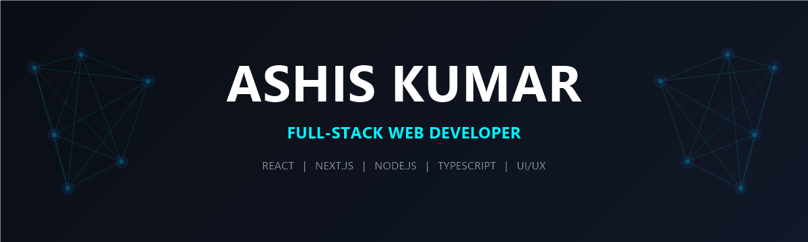

<div align="center">

<!-- Custom Generated Cyber-Glow Banner -->


<br/><br/>

<!-- Typing Animation -->
<a href="https://github.com/ashis2489">
  
</a>

<br/>

<!-- Visitor Counter & Quick Stats -->
<p align="center">
  
  &nbsp;
  <a href="https://github.com/ashis2489?tab=followers">
    
  </a>
  &nbsp;
  <a href="https://ashis2489.vercel.app">
    
  </a>
  &nbsp;
  
</p>

<!-- Social Links -->
<p align="center">
  <a href="https://linkedin.com/in/ashis2489" target="_blank">
    
  </a>
  &nbsp;
  <a href="https://twitter.com/ashis2489" target="_blank">
    
  </a>
  &nbsp;
  <a href="mailto:ashis2489@gmail.com">
    
  </a>
</p>

</div>

<br/>

---

## 💫 About Me

<table border="0" width="100%">
<tr>
<td width="58%" valign="top">

### 🚀 Who I Am
I'm a passionate **Full-Stack Web Developer** and **UI Craftsman** from India 🇮🇳. I love creating premium, performant, and user-centric web applications.

- 🔭 **Current Focus:** Crafting premium web experiences and exploring scalable system designs.
- 🎓 **Learning Journey:** Diving deep into AWS, Cloud Architecture, and Web3 technologies.
- 💬 **Ask me about:** React, Next.js, Node.js, and CSS animations.
- 🎨 **Design Philosophy:** Clean, responsive, and interactive design is not a luxury, it's a necessity.

<br/>

<!-- Interactive Developer Config Diagnostic -->
<details>
  <summary><b>💻 RUN ASHIS DIAGNOSTICS (Click to boot specs)</b></summary>
  <br/>
  
```typescript
const ashis: Developer = {
  name:        "Ashis Kumar",
  username:    "ashis2489",
  role:        "Full-Stack Web Developer",
  location:    "India 🇮🇳",
  learning:    ["System Design", "AWS", "Web3"],
  openTo:      ["Collaborations", "Freelance", "FTE"],
  funFact:     "I debug with console.log and I'm not ashamed 😄",
  motto:       "Code. Create. Contribute. Repeat. 🔁"
};
```
</details>

</td>
<td width="42%" align="center" valign="middle">
  
</td>
</tr>
</table>

<br/>

---

## 🛠️ Tech Stack & Tools

<details open>
  <summary><b>🎨 Frontend Arsenal (Click to collapse)</b></summary>
  <br/>
  <p align="center">
    
  </p>
</details>

<details open>
  <summary><b>⚙️ Backend & Database gear (Click to collapse)</b></summary>
  <br/>
  <p align="center">
    
  </p>
</details>

<details open>
  <summary><b>🧰 Tools & Platforms (Click to collapse)</b></summary>
  <br/>
  <p align="center">
    
  </p>
</details>

<br/>

---

## 📊 GitHub Analytics

<div align="center">

<table border="0">
<tr>
<td align="center" valign="top" width="50%">
  
</td>
<td align="center" valign="top" width="50%">
  
</td>
</tr>
<tr>
<td colspan="2" align="center" valign="top">
  <br/>
  
</td>
</tr>
<tr>
<td colspan="2" align="center" valign="top">
  <br/>
  
</td>
</tr>
</table>

</div>

<br/>

---

## 🏆 GitHub Trophies

<div align="center">


</div>

<br/>

---

## 🚀 Featured Projects

<div align="center">

<table border="0">
<tr>
<td align="center">
  <a href="https://github.com/ashis2489/disha-for-india">
    
  </a>
</td>
<td align="center">
  <a href="https://github.com/ashis2489/e-education">
    
  </a>
</td>
</tr>
<tr>
<td align="center">
  <a href="https://github.com/ashis2489/task-manager">
    
  </a>
</td>
<td align="center">
  <a href="https://github.com/ashis2489/ecomnerce_work">
    
  </a>
</td>
</tr>
</table>

</div>

<br/>

---

## ⚡ Recent Activity

<!--START_SECTION:activity-->
<table>
  <tr>
    <td>
      <p align="center">
        <i>🔄 Feeds are automatically synced via GitHub actions. View my profile repository commits for details!</i>
      </p>
    </td>
  </tr>
</table>
<!--END_SECTION:activity-->

<br/>

---

## 🐍 Contribution Snake

<div align="center">

<picture>
  <source media="(prefers-color-scheme: dark)" srcset="https://raw.githubusercontent.com/ashis2489/ashis2489/output/github-contribution-grid-snake-dark.svg"/>
  <source media="(prefers-color-scheme: light)" srcset="https://raw.githubusercontent.com/ashis2489/ashis2489/output/github-contribution-grid-snake.svg"/>
  
</picture>

</div>

<br/>

---

## 🤝 Let's Connect & Collaborate

<div align="center">

<p>
  <i>I'm always open to interesting projects, collaborations, and conversations!</i><br/>
  <i>Whether you have a project in mind or just want to say hi — my inbox is always open.</i>
</p>

<br/>

<a href="https://linkedin.com/in/ashis2489" target="_blank">
  
</a>
&nbsp;&nbsp;
<a href="mailto:ashis2489@gmail.com">
  
</a>
&nbsp;&nbsp;
<a href="https://ashis2489.vercel.app" target="_blank">
  
</a>

<br/><br/>

<!-- Quote -->


<br/><br/>

<sub>⭐ <b>Star my repos if you find them useful!</b> &nbsp;|&nbsp; Made with ❤️ by <a href="https://github.com/ashis2489"><b>Ashis Kumar</b></a></sub>

</div>
