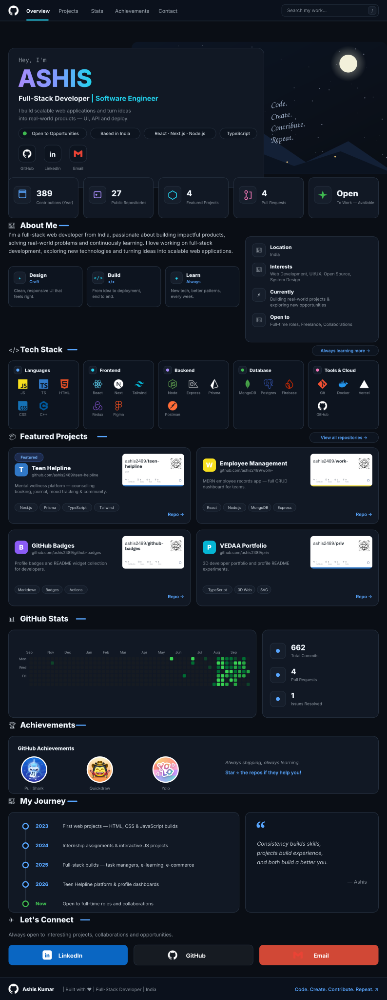

<p align="center">
  
</p>

<div align="center">
  <a href="https://github.com/ashis2489"></a>
  <a href="https://linkedin.com/in/ashish-vibhor-506a1a28a"></a>
  <a href="https://leetcode.com/u/2301301008/"></a>
  <a href="mailto:ashis2489@gmail.com"></a>
  
</div>

<details>
  <summary><b>🖥️ Run <code>ashis.exe</code> — click to boot specs</b></summary>
  <br/>

```typescript
const ashis: Developer = {
  name:        "Ashish Vibhor",
  username:    "ashis2489",
  leetcode:    "2301301008",
  role:        "Full-Stack Web Developer",
  location:    "India 🇮🇳",
  stack:       ["React", "Next.js", "TypeScript", "Node.js"],
  learning:    ["System Design", "AWS", "Cloud Architecture"],
  openTo:      ["Collaborations", "Freelance", "Full-time"],
  funFact:     "I debug with console.log and I'm not ashamed 🙈",
  motto:       "Code. Create. Contribute. Repeat. ⚡"
};
```

</details>

### Recent activity

<!--START_SECTION:activity-->
1. 🎉 Merged PR [#5](https://github.com/ashis2489/github-badges/pull/5) in [ashis2489/github-badges](https://github.com/ashis2489/github-badges)
2. 💪 Opened PR [#5](https://github.com/ashis2489/github-badges/pull/5) in [ashis2489/github-badges](https://github.com/ashis2489/github-badges)
3. 🎉 Merged PR [#4](https://github.com/ashis2489/github-badges/pull/4) in [ashis2489/github-badges](https://github.com/ashis2489/github-badges)
4. 💪 Opened PR [#4](https://github.com/ashis2489/github-badges/pull/4) in [ashis2489/github-badges](https://github.com/ashis2489/github-badges)
5. 🔒 Closed issue [#3](https://github.com/ashis2489/github-badges/issues/3) in [ashis2489/github-badges](https://github.com/ashis2489/github-badges)
6. ℹ️ Assigned issue [#3](https://github.com/ashis2489/github-badges/issues/3) in [ashis2489/github-badges](https://github.com/ashis2489/github-badges)
<!--END_SECTION:activity-->

<details>
  <summary>⌨️ Coding stats</summary>
  <br/>

  <!--START_SECTION:waka-->
  <!--END_SECTION:waka-->

</details>

<details>
  <summary>🐍 Contribution snake</summary>
  <br/>

  

</details>
