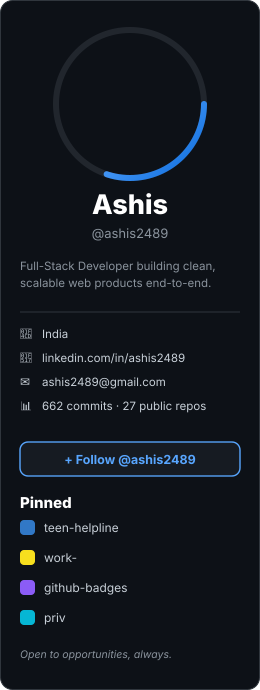
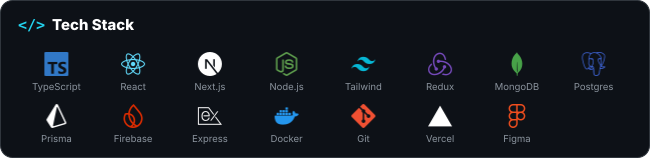
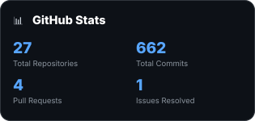
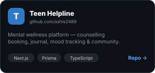
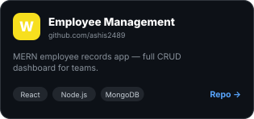
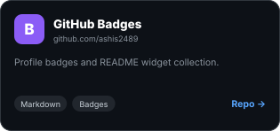
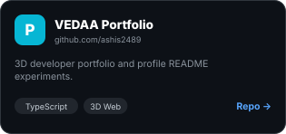
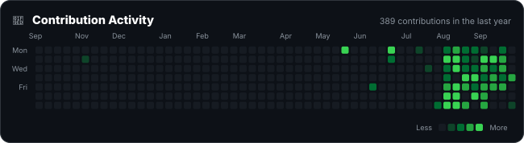

<table>
  <tr>
    <td width="260" valign="top">
      
    </td>
    <td valign="top">
      <a href="https://github.com/ashis2489?tab=repositories">
        
      </a>
      <br/>
      
      <br/>
      <table width="100%" cellspacing="12">
        <tr>
          <td width="50%" valign="top">
            <a href="https://github.com/ashis2489">
              
            </a>
          </td>
          <td width="50%" valign="top">
            
          </td>
        </tr>
      </table>
      <br/>
      <table width="100%" cellspacing="12">
        <tr>
          <td width="50%" valign="top">
            <a href="https://github.com/ashis2489/teen-helpline">
              
            </a>
          </td>
          <td width="50%" valign="top">
            <a href="https://github.com/ashis2489/work-">
              
            </a>
          </td>
        </tr>
        <tr>
          <td width="50%" valign="top">
            <a href="https://github.com/ashis2489/github-badges">
              
            </a>
          </td>
          <td width="50%" valign="top">
            <a href="https://github.com/ashis2489/priv">
              
            </a>
          </td>
        </tr>
      </table>
      <br/>
      
    </td>
  </tr>
</table>

<br/>

<div align="center">
  <a href="https://github.com/ashis2489"></a>
  <a href="https://linkedin.com/in/ashis2489"></a>
  <a href="mailto:ashis2489@gmail.com"></a>
  
</div>

<details>
  <summary><b>🖥️ Run <code>ashis.exe</code> — click to boot specs</b></summary>
  <br/>

```typescript
const ashis: Developer = {
  name:        "Ashis Kumar",
  username:    "ashis2489",
  role:        "Full-Stack Web Developer",
  location:    "India 🇮🇳",
  stack:       ["React", "Next.js", "TypeScript", "Node.js"],
  learning:    ["System Design", "AWS", "Cloud Architecture"],
  openTo:      ["Collaborations", "Freelance", "Full-time"],
  funFact:     "I debug with console.log and I'm not ashamed 🙈",
  motto:       "Code. Create. Contribute. Repeat. ⚡"
};
```

</details>

### Latest projects

<p><sub>Auto-updated with my most recently pushed repositories.</sub></p>

<!--PROJECTS:START-->
- [priv](https://github.com/ashis2489/priv) — TypeScript
- [github-badges](https://github.com/ashis2489/github-badges)
- [teen-helpline](https://github.com/ashis2489/teen-helpline) — TypeScript · work
- [work-](https://github.com/ashis2489/work-) — JavaScript
- [tasky-manger](https://github.com/ashis2489/tasky-manger)
<!--PROJECTS:END-->

### Recent activity

<!--START_SECTION:activity-->
1. 🎉 Merged PR [#5](https://github.com/ashis2489/github-badges/pull/5) in [ashis2489/github-badges](https://github.com/ashis2489/github-badges)
2. 💪 Opened PR [#5](https://github.com/ashis2489/github-badges/pull/5) in [ashis2489/github-badges](https://github.com/ashis2489/github-badges)
3. 🎉 Merged PR [#4](https://github.com/ashis2489/github-badges/pull/4) in [ashis2489/github-badges](https://github.com/ashis2489/github-badges)
4. 💪 Opened PR [#4](https://github.com/ashis2489/github-badges/pull/4) in [ashis2489/github-badges](https://github.com/ashis2489/github-badges)
5. 🔒 Closed issue [#3](https://github.com/ashis2489/github-badges/issues/3) in [ashis2489/github-badges](https://github.com/ashis2489/github-badges)
6. ℹ️ Assigned issue [#3](https://github.com/ashis2489/github-badges/issues/3) in [ashis2489/github-badges](https://github.com/ashis2489/github-badges)
<!--END_SECTION:activity-->

<details>
  <summary>⌨️ Coding stats</summary>
  <br/>

  <!--START_SECTION:waka-->
  <!--END_SECTION:waka-->

</details>

### Contribution snake

<p align="center">
  
</p>

---

<div align="center">
  <sub>Built by <a href="https://github.com/ashis2489"><b>Ashis Kumar</b></a> — open to interesting projects, so say hi 👋</sub>
</div>
