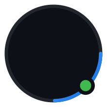

<div align="center">
  

  <p>
    
    <a href="https://linkedin.com/in/ashis2489"></a>
    <a href="mailto:ashis2489@gmail.com"></a>
  </p>

  <table>
    <tr>
      <td width="220" align="center" valign="middle">
        
      </td>
      <td align="center" valign="middle">
        <a href="https://github.com/ashis2489">
          
        </a>
        <br/>
        
      </td>
    </tr>
  </table>
</div>

---

### About me

I build fast, good-looking web apps with **React**, **Next.js** and **Node.js** — from the UI down to the API and the deploy. Based in India, open to full-time roles and collaborations.

- 🔭 **Working on:** premium web experiences and scalable backends
- 🌱 **Learning:** AWS, cloud architecture, system design
- 💬 **Ask me about:** React, Next.js, TypeScript, Tailwind CSS

<details>
  <summary><b>🖥️ Run <code>ashis.exe</code> — click to boot specs</b></summary>
  <br/>

```typescript
const ashis: Developer = {
  name:        "Ashis Kumar",
  username:    "ashis2489",
  role:        "Full-Stack Web Developer",
  location:    "India 🇮🇳",
  stack:       ["React", "Next.js", "TypeScript", "Node.js"],
  learning:    ["System Design", "AWS", "Cloud Architecture"],
  openTo:      ["Collaborations", "Freelance", "Full-time"],
  funFact:     "I debug with console.log and I'm not ashamed 🙈",
  motto:       "Code. Create. Contribute. Repeat. ⚡"
};
```

</details>

### Tech stack

<details open>
  <summary><b>🎨 Frontend</b></summary>
  <br/>
  <p align="center">
    
  </p>
</details>

<details open>
  <summary><b>⚙️ Backend &amp; database</b></summary>
  <br/>
  <p align="center">
    
  </p>
</details>

<details open>
  <summary><b>🛠️ Tools &amp; platforms</b></summary>
  <br/>
  <p align="center">
    
  </p>
</details>

### Featured projects

| Project | Stack | What it is |
|---------|-------|------------|
| **[teen-helpline](https://github.com/ashis2489/teen-helpline)** | Next.js · Prisma · TypeScript | Teen mental-health platform — counselling booking, journal, mood tracking, community |

### Latest projects

<p><sub>Auto-updated with my most recently pushed repositories.</sub></p>

<!--PROJECTS:START-->
- [priv](https://github.com/ashis2489/priv) — TypeScript
- [github-badges](https://github.com/ashis2489/github-badges)
- [teen-helpline](https://github.com/ashis2489/teen-helpline) — TypeScript · work
- [work-](https://github.com/ashis2489/work-) — JavaScript
- [tasky-manger](https://github.com/ashis2489/tasky-manger)
<!--PROJECTS:END-->

### Contribution streak

<div align="center">
  
</div>

### Contribution snake

<p align="center">
  
</p>

### Recent activity

<!--START_SECTION:activity-->
1. 🎉 Merged PR [#5](https://github.com/ashis2489/github-badges/pull/5) in [ashis2489/github-badges](https://github.com/ashis2489/github-badges)
2. 💪 Opened PR [#5](https://github.com/ashis2489/github-badges/pull/5) in [ashis2489/github-badges](https://github.com/ashis2489/github-badges)
3. 🎉 Merged PR [#4](https://github.com/ashis2489/github-badges/pull/4) in [ashis2489/github-badges](https://github.com/ashis2489/github-badges)
4. 💪 Opened PR [#4](https://github.com/ashis2489/github-badges/pull/4) in [ashis2489/github-badges](https://github.com/ashis2489/github-badges)
5. 🔒 Closed issue [#3](https://github.com/ashis2489/github-badges/issues/3) in [ashis2489/github-badges](https://github.com/ashis2489/github-badges)
6. ℹ️ Assigned issue [#3](https://github.com/ashis2489/github-badges/issues/3) in [ashis2489/github-badges](https://github.com/ashis2489/github-badges)
<!--END_SECTION:activity-->

<details>
  <summary>⌨️ Coding stats</summary>
  <br/>

  <!--START_SECTION:waka-->
  <!--END_SECTION:waka-->

</details>

---

<div align="center">
  <sub>Built by <a href="https://github.com/ashis2489"><b>Ashis Kumar</b></a> — open to interesting projects, so say hi 👋</sub>
</div>
