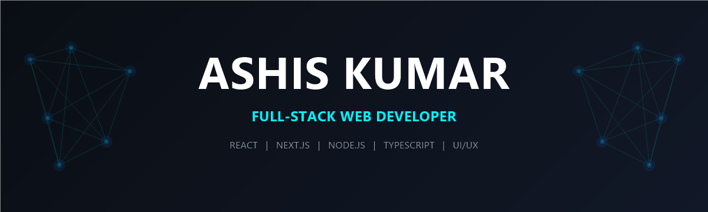

  

  

    
    
    
    
  

---

### About me

I build fast, good-looking web apps with **React**, **Next.js** and **Node.js** — from the UI down to the API and the deploy. Based in India, open to full-time roles and collaborations.

- 🔭 **Working on:** premium web experiences and scalable backends
- 🌱 **Learning:** AWS, cloud architecture, system design
- 💬 **Ask me about:** React, Next.js, TypeScript, Tailwind CSS

### Tech stack

  

### Featured projects

| Project | Stack | What it is |
|---------|-------|------------|
| **[teen-helpline](https://github.com/ashis2489/teen-helpline)** | Next.js · Prisma · TypeScript | Teen mental-health platform — counselling booking, journal, mood tracking, community |
| **Disha for India** | Next.js · Supabase | Safe space for teens and families — guidance, counselling, resources |
| **Nirogitanman** | React · Vite | Premium Ayurvedic brand digital experience |
| **Campus Delivery** | React · Django · Tailwind | Food ordering built for university campuses, hostels and academic blocks |

### Latest projects

Auto-updated with my most recently pushed repositories.

<!--PROJECTS:START-->
- [priv](https://github.com/ashis2489/priv) — TypeScript
- [github-badges](https://github.com/ashis2489/github-badges)
- [teen-helpline](https://github.com/ashis2489/teen-helpline) — TypeScript · work
- [work-](https://github.com/ashis2489/work-) — JavaScript
- [tasky-manger](https://github.com/ashis2489/tasky-manger)
<!--PROJECTS:END-->

### GitHub stats

  
  

### Contribution snake

  

### Recent activity

<!--START_SECTION:activity-->
1. 🎉 Merged PR [#5](https://github.com/ashis2489/github-badges/pull/5) in [ashis2489/github-badges](https://github.com/ashis2489/github-badges)
2. 🚀 Opened PR [#5](https://github.com/ashis2489/github-badges/pull/5) in [ashis2489/github-badges](https://github.com/ashis2489/github-badges)
3. 🎉 Merged PR [#4](https://github.com/ashis2489/github-badges/pull/4) in [ashis2489/github-badges](https://github.com/ashis2489/github-badges)
4. 🚀 Opened PR [#4](https://github.com/ashis2489/github-badges/pull/4) in [ashis2489/github-badges](https://github.com/ashis2489/github-badges)
5. ❌ Closed issue [#3](https://github.com/ashis2489/github-badges/issues/3) in [ashis2489/github-badges](https://github.com/ashis2489/github-badges)
6. 👀 Assigned issue [#3](https://github.com/ashis2489/github-badges/issues/3) in [ashis2489/github-badges](https://github.com/ashis2489/github-badges)
<!--END_SECTION:activity-->

  
⌨️ Coding stats

   

  <!--START_SECTION:waka-->
  <!--END_SECTION:waka-->

---

  Built by <a href="https://github.com/ashis2489"><b>Ashis Kumar</b></a> — open to interesting projects, so say hi 👋

